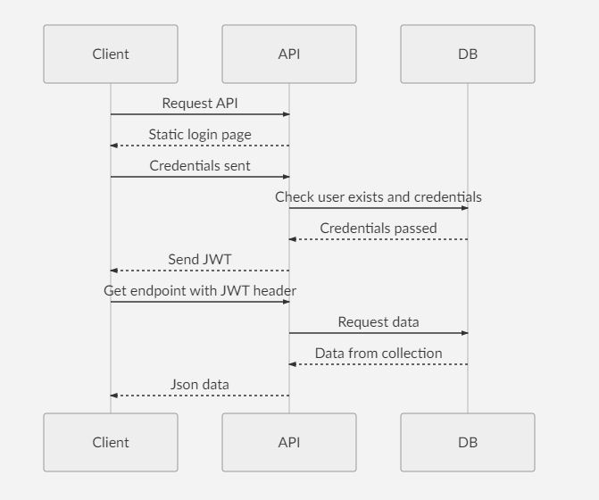

# NodeJs Rest API with JWT

Rest API based on NodeJs, expressJs, PassportJs. 
Uses JsonWebTokens for authentication.

## Getting started

Create mongoDb database. Then start mongod.

Set your DB path in MONGODB_URI variable of .env file placed in root directory.

    git clone https://github.com/antmihlin/nodejs-restapi.git
    
    cd <directory of the project>
    
    npm install
    
    npm start

## Diagram

## References

 - [PassportJs](http://www.passportjs.org/)
 - [NodeJs](https://nodejs.org/en/)
 - [MongoDb](https://www.mongodb.com/)
 - [JWT](https://jwt.io)
 - [Mermaid](https://mermaidjs.github.io/)
